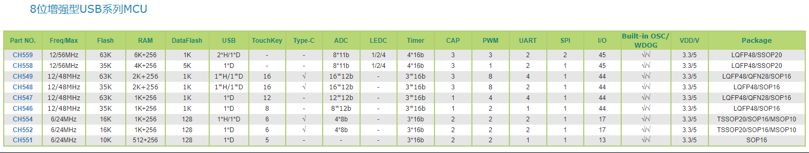

# [WCH](https://github.com/mcuyun/WCH) 

#### 设备归属：[8051内核](https://github.com/mcuyun/8051) 

## [简介](https://github.com/mcuyun/WCH/wiki) 

WCH是国内出名的USB通信产品，主要基于增强8051内核。

## [组成](mcuyun/) 

#### [CH552](https://github.com/mcuyun/CH552) 

极低成本USB通信芯片，拥有不错的处理速度和丰富的外设

#### [CH554](https://github.com/mcuyun/CH554) 

低成本USB通信芯片，功能全面资料丰富

#### [CH558](https://github.com/mcuyun/CH558) 

高性能USB通信芯片，十分强大丰富

---

###  [悠云，为嵌入式](http://www.mcuyun.com)
####  qitas@qitas.cn
####  2019-1-4
