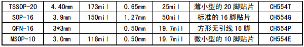

# [CH554](https://github.com/SoCXin/CH554) 

 

#### [Vendor](https://github.com/SoCXin/Vendor)：[WCH](https://github.com/SoCXin/WCH)
#### [Core](https://github.com/SoCXin/8051)：[E8051](https://github.com/SoCXin/8051)
#### [Level](https://github.com/SoCXin/Level)：6/24MHz 

### [CH554简介](https://github.com/SoCXin/CH554/wiki)

[CH554](https://github.com/SoCXin/CH554) 是[WCH](https://github.com/SoCXin/WCH)一款增强型8051内核单片机，79%指令是单字节单周期指令，内置24MHz时钟源，内置1K+256B RAM，16KB iFlash-ROM。

CH554提供丰富的接口资源，包括ADC模数转换、3组定时器和信号捕捉及PWM、双异步串口、SPI等。

CH554提供6通道电容检测模块，互电容方式支持最多15个触摸按键。内嵌全速USB控制器,支持USB HOST主机模式和USB DEVICE设备模式。

 
 

* 芯片封装：TSSOP20、MSOP10、QFN16、SOP16

 
 

### [资源收录](https://github.com/SoCXin)

* [参考文档](docs/)
* [参考资源](src/)

#### [外部资源](https://github.com/SoCXin)

* [OS-Q H05](https://github.com/OS-Q/H05)
* [编译器SDCC](https://github.com/SoCXin/sdcc)

#### [参考项目](https://github.com/SoCXin)

* [ch554_sdcc](https://github.com/Blinkinlabs/ch554_sdcc)
* [CH55x_USB_CompositeDevice](https://github.com/rikka0w0/CH55x_USB_CompositeDevice)

### [选型建议](https://github.com/SoCXin)

[CH554](https://github.com/SoCXin/CH554) 可看作在[CH552](https://github.com/SoCXin/CH552) 基础上添加了USB主机功能，代码兼容，对于不需要主机功能的场景下使用性价比不高。

###  [SoC芯平台](http://SoC.Xin) 
