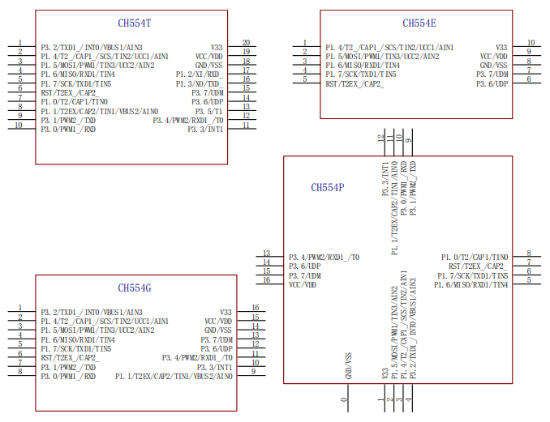

# [CH554](https://github.com/sochub/CH554) 

 

#### [Vendor](https://github.com/sochub/Vendor)：[WCH](https://github.com/sochub/WCH)
#### [Cortex](https://github.com/sochub/Cortex)：[E8051](https://github.com/sochub/8051)
#### [Level](https://github.com/sochub/Level)：6/24MHz 

### [CH554简介](https://github.com/sochub/CH554/wiki)

[CH554](https://github.com/sochub/CH554) 是WCH的一款增强型8051内核单片机，79%的指令是单字节单周期指令，内置24MHz时钟源，内置1K+256B RAM，16KB iFlash-ROM。

CH554提供丰富的接口资源，包括ADC模数转换、3组定时器和信号捕捉及PWM、双异步串口、SPI等。

CH554提供6通道电容检测模块，互电容方式支持最多15个触摸按键。内嵌全速USB控制器,支持USB HOST主机模式和USB DEVICE设备模式。

 
 

主要特点：

* USB2.0全速主机或设备模式
* 2路PWM输出 + 2个异步串口 + 1个SPI接口
* 芯片封装：TSSOP20、MSOP10、SOP16

 

### [资源收录](https://github.com/sochub)

* [参考文档](docs/)
* [参考资源](src/)
* [编译工具SDCC](https://github.com/sochub/sdcc-x64)

### [选型建议](https://github.com/sochub)

2倍左右性能和资源增幅可选[CH558](https://github.com/sochub/CH558)或[CH559](https://github.com/sochub/CH559)替换，提供LQFP48封装

相同规格成本略低替换可选[CH552](https://github.com/sochub/CH552)或[CH551](https://github.com/sochub/CH551)替换，代码和封装兼容

更多功能接口或无线集成可选[CH56系列](https://github.com/sochub/CH56)或[CH57系列](https://github.com/sochub/CH57)替换，同厂方案

近似8051处理器，全面升级替换可选[CH54系列](https://github.com/sochub/CH54)

###  [SoC资源平台](http://www.qitas.cn)  
