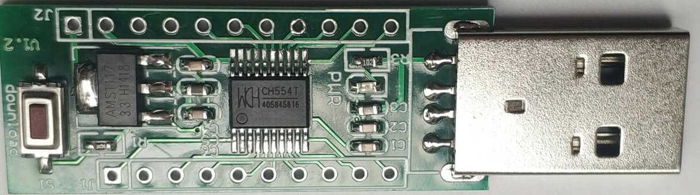

# [CH554](https://github.com/SoCXin/CH554)

#### [WCH](http://www.wch.cn/)：[8051](https://github.com/SoCXin/8051) MCU
#### [Level](https://github.com/SoCXin/Level)：24 MHz

### [Xin简介](https://github.com/SoCXin/CH554/wiki)

[CH554](https://github.com/SoCXin/CH554) 增强型E8051内核，79%指令是单字节单周期指令，2KB Boot + 14KB Flash，1K xRAM(支持DMA) +256B iRAM，128B DataFlash。

CH554提供丰富的接口资源，包括ADC模数转换、3组定时器和信号捕捉及PWM、双异步串口、SPI等。6通道电容检测模块，互电容方式支持最多15个触摸按键。内嵌全速USB控制器,支持USB HOST主机模式和USB DEVICE设备模式。

#### 关键特性

* 集成 5V->3.3V LDO
* 128B DataFlash
* 内置24MHz时钟源和PLL
* 内置2KB BootLoader，支持USB和串口ISP
* USB HOST 主机模式
* 小封装(TSSOP20/SOP16/MSOP10/QFN16)

### [资源收录](https://github.com/SoCXin)

* [参考资源](src/)
* [参考文档](docs/)
* [参考工程](project/)

### [选型建议](https://github.com/SoCXin)

[CH554](https://github.com/SoCXin/CH554)是一款广泛应用的低成本USB MCU，应用于各种简单外设，软硬件兼容的同厂商产品还包括：

* [CH552](http://www.wch.cn/products/CH552.html) 在[CH554](http://www.wch.cn/products/CH554.html)的基础上，不支持USB-HOST主机模式
* [CH551](http://www.wch.cn/products/CH551.html) 在[CH552](http://www.wch.cn/products/CH552.html)的基础上，ROM降为10K，xRAM为512字节，串口仅UART0，封装仅SOP16，去掉了ADC和USB type-C功能。
#### 相关开发板

### [探索芯世界 www.SoC.xin](http://www.SoC.Xin)
